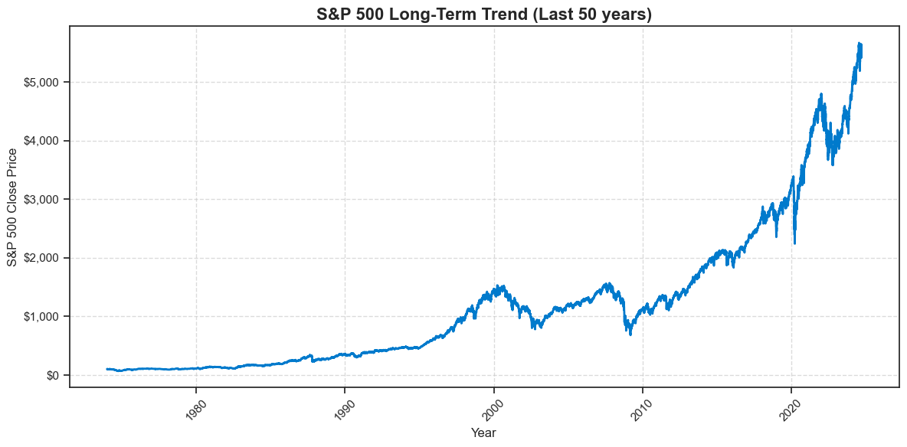
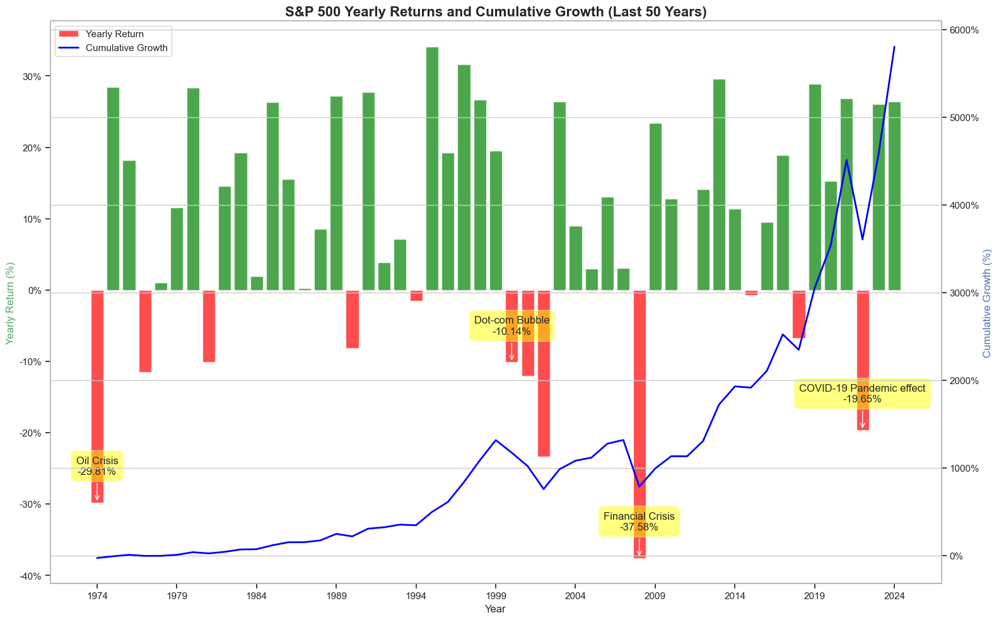
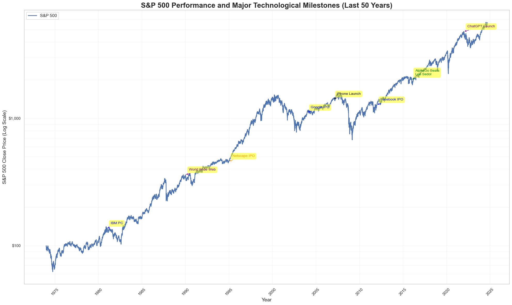
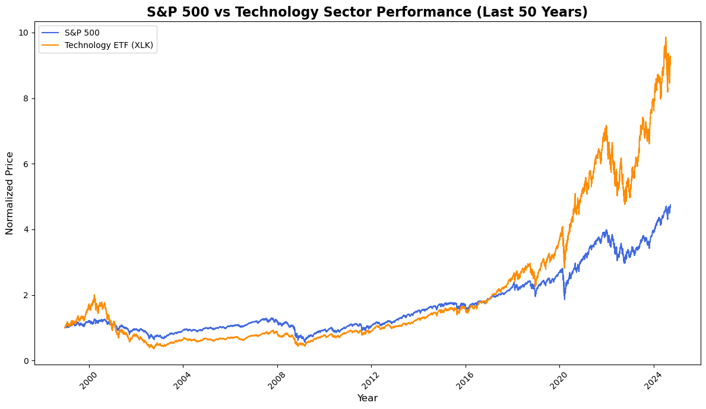
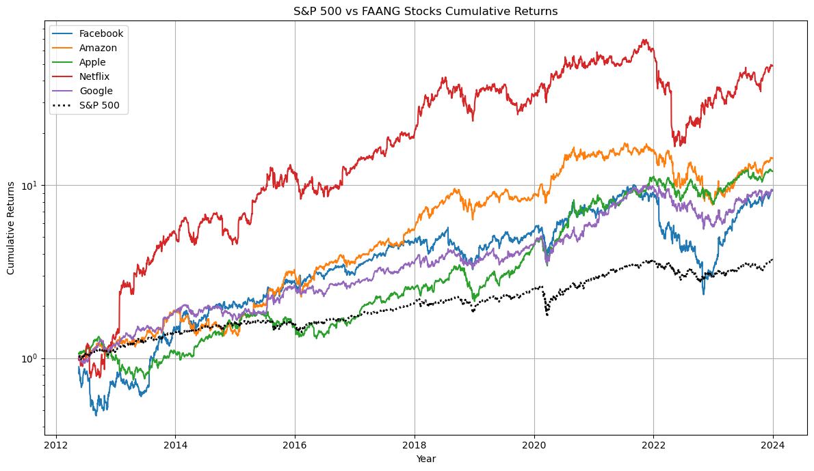
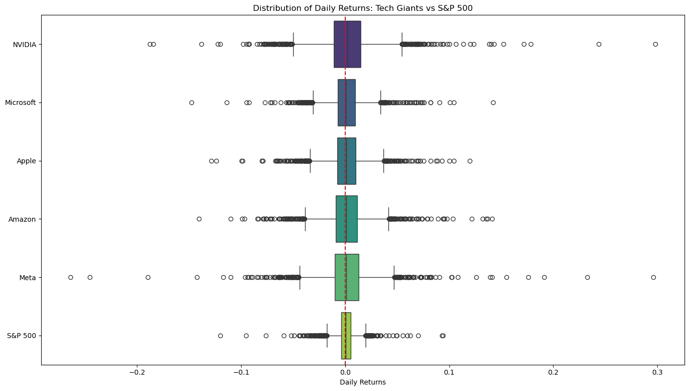
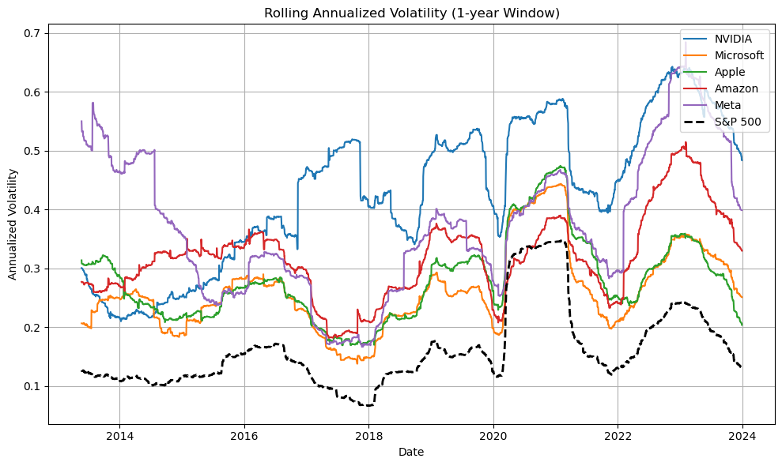
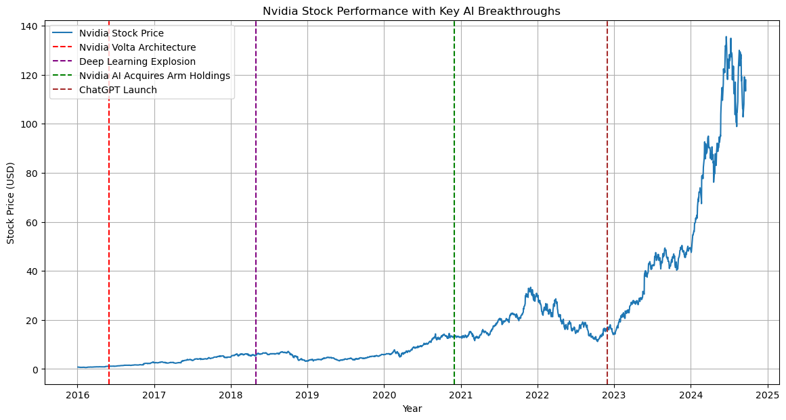

# S&P 500 VS Technology Sector Analysis

## Overview

This project analyzes the impact of technological advancements on the S&P 500 index and its individual components over the past 50 years, focusing on significant milestones, sector performance, and key players in the tech industry, particularly Nvidia. Utilizing historical data from the Yahoo Finance, this analysis explores trends, cumulative returns, volatility, and the role of major technological breakthroughs in shaping market dynamics.

## Objective

 To comprehensively analyze the impact of technological advancements on the S&P 500, focusing on long-term trends, sector performance, and volatility, while specifically examining the effects of the AI revolution on Nvidia's stock performance.

### Key Areas of Focus:
**1. S&P 500 Long-Term Trend and Technological Impact:**

Analyze the historical performance of the S&P 500 over the last 50 years, highlighting patterns during significant economic events and investigating how major technological milestones (e.g., the rise of the internet, smartphones, AI) have influenced the index's trajectory.

**2. Tech-Sector Performance Comparison:** 

Compare the performance of the technology sector (represented by the XLK ETF) against the S&P 500, with a focus on the contributions of FAANG stocks.

**3. Volatility Analysis:**

Assess the volatility of key technology stocks, particularly Nvidia, in relation to the S&P 500, exploring the implications for investment strategies and risk management.

**4. AI Revolution and Nvidia:**
 
Examine the correlation between significant AI breakthroughs and Nvidia’s stock performance, emphasizing its role as a leader in AI technology and its impact on the broader tech sector.

## Data Sources

- **Yahoo Finance** (`yfinance`): Used to fetch historical data for S&P 500, XLK ETF, FAANG stocks, and Nvidia.
- Data from 1974–2023 was collected for a long-term analysis of market trends for last 50 years.


## Tools and Technologies Used
- **Programming Language:** Python
- **Development Environment:** Jupyter Notebook
- **Code Editor:** Visual Studio Code
- **Package Management:** Conda
- **Data Retrieval:** yfinance (Yahoo Finance API)
- **Data Analysis and Manipulation:**
   - Pandas
   - NumPy
- **Data Visualization:**
  - Matplotlib
  - Seaborn
- **Version Control:** Git and GitHub
## Skills Demonstrated

- **Data Collection**: Automated fetching of historical stock market data using Python.
- **Data Wrangling**: Cleaning and preprocessing stock data for analysis.
- **Visualization**: Advanced visualizations of trends, cumulative returns, and volatility using `matplotlib` and `seaborn`.
- **Statistical Analysis**: Computing yearly returns, cumulative growth, volatility, and key financial insights.
- **Storytelling**: Annotating visualizations with significant historical and technological events to provide meaningful context.

---

## Project Structure

### 1. **S&P 500 Long-Term Trend Analysis** 
[Notebook Link](1.S&P500_Market_trend_analysis.ipynb)

**Question**: *What is the trend of the S&P 500 over the last 50 years?* 

#### Code Snippet:
```python
# Download S&P 500 historical data (last 50 years)
sp500 = yf.Ticker('^GSPC')  # ^gspc is the ticker for sp500 
sp500_df = sp500.history(start='1974-01-02') # took historic data of open, high, close, volume, dividends, stock splits, date as index for last 50 years

# ploting the graph
sns.set_theme(style='ticks')
fig, ax = plt.subplots(figsize=(12, 6))
sns.lineplot(data=sp500_df, x=sp500_df.index, y='Close', ax=ax, linewidth=2, color='#007acc')
ax.set_title('S&P 500 Long-Term Trend (Last 50 years)', fontsize=16, fontweight='bold')
ax.set_xlabel('Year', fontsize=12)
ax.set_ylabel('S&P 500 Close Price', fontsize=12)
# Rotate x-axis labels for better readability
plt.xticks(rotation=45)
# add $ sign to y axis
ax.yaxis.set_major_formatter(plt.FuncFormatter(lambda x, p: f'${x:,.0f}'))
# Add gridlines
ax.grid(True, linestyle='--', alpha=0.7)

plt.tight_layout()
plt.show()
```
**Visualization:** 



**Insights:**
- The S&P 500 has exhibited an overall upward trend over the last 50 years.
- Sharp declines are visible during major economic downturns, such as the Dot-com Bubble (2000) and the 2008 Financial Crisis, but recovery was steady.

### 1.2 Yearly and Cumulative Returns of S&P 500

**Question:** What are the yearly returns of the S&P 500, and how has cumulative growth evolved?

**Code Snippet:**
```python
# Calculating yearly returns
sp500_df['Year'] = sp500_df.index.year
sp500_df['Yearly_Return'] = sp500_df['Close'].pct_change(252) * 100  # because there are usually 252 trading days in a year
# Group by year to get yearly returns
yearly_returns = sp500_df.groupby('Year')['Yearly_Return'].last()

# Creating a df for resturns
df_returns = yearly_returns.reset_index()
df_returns.columns = ['Year', 'Return']

# Calculating cumulative returns
df_returns['Cumulative'] = (1 + df_returns['Return'] / 100).cumprod() - 1
```
**Visualization:** 



## Insights

- **Best Year:**: The highest annual return for the S&P 500 was in 1995 with over 34% growth.
- **Worst Year:**: In 2008, the market experienced a sharp decline of -38%.
- **Cumulative Growth:**: Over the last 50 years, the S&P 500's cumulative growth exceeded 5000%.

### 1.3 Technology Milestones and SP500

**Question:**:  3. How did the majot technological milestones such as rise of internet, smartphones, AI affected S&P500?

**Code Snippet:**:
```python
# Defining major technological milestones
milestones = [
    (1981, 'IBM PC', 'blue'),
    (1990, 'World Wide Web', 'purple'),
    (1995, 'Netscape IPO', 'orange'),
    (2004, 'Google IPO', 'blue'),
    (2007, 'iPhone Launch', 'black'),
    (2012, 'Facebook IPO', 'blue'),
    (2016, 'AlphaGo Beats\nLee Sedol', 'green'),
    (2022, 'ChatGPT Launch', 'purple')
]

#Plotting technological milestones on the S&P 500 graph
for year, event, color in milestones:
    if year in sp500_df.index.year:
        price = sp500_df.loc[sp500_df.index.year == year, 'Close'].values[0]
        plt.annotate(event, (mdates.date2num(pd.Timestamp(f'{year}-01-01')), price), xytext=(10, 10), 
                     textcoords='offset points', ha='left', va='bottom',
                     bbox=dict(boxstyle='round,pad=0.5', fc='yellow', alpha=0.5),
                     arrowprops=dict(arrowstyle='->', connectionstyle='arc3,rad=0', color=color),
                     fontsize=10, color=color)

```


**Visualization:**



**Insights:**
  - The introduction of the IBM PC (1981) and Netscape IPO (1995) marked the beginning of significant market shifts.
  - The rise of smartphones (2007) and AI (2022) caused even more rapid growth, particularly after 2016.

### 2. Impact of Technological Advancements on S&P 500
[Notebook Link](2.Impact_of_technology.ipynb)


### 2.1 Technology Sector Outperformance
**Question:**: How has the technology sector (XLK ETF) outperformed the S&P 500?
**Code Snippet:**:

```python

# first we need to download XLK data from yfinance
tech_etf = yf.Ticker('XLK')
tech_etf_df = tech_etf.history(period='max')
# S&P500 data from 1998-12-22 for comparison with XLK
sp500 = yf.Ticker('^GSPC')  # ^gspc is the ticker for sp500 
sp500_df = sp500.history(start='1998-12-22')
# for normilization divide the closing value with the starting close value of the fund as it helps to compare percentage change of the closing price of both funds over time.
sp500_df['Normalized_Close'] = sp500_df['Close'] / sp500_df['Close'].iloc[0]
tech_etf_df['Normalized_Close'] = tech_etf_df['Close'] / tech_etf_df['Close'].iloc[0]

```
**Visualization:**: 


**Insights:**:
  - From 1998 to 2023, the technology sector has been in align with the S&P 500, however, since 2016,  when AI started to gain traction it has dramatically outperformed SP500.

### 2.2 FAANG Stocks vs. S&P 500
**Question:**: What is the impact of FAANG stocks on the market?
**Code Snippet:**:

```python

# created a fn to fetch data
def fetch_data(ticker, start_date, end_date):
    return yf.download(ticker, start=start_date, end=end_date)['Adj Close']

# Set date range
start_date = '2000-01-01'
end_date = '2023-12-31'

# List of tech companies and their tickers
tech_companies = {
    'Facebook': 'META',
    'Amazon': 'AMZN',
    'Apple': 'AAPL',
    'Netflix': 'NFLX',
    'Google': 'GOOGL',
}

# Download data
faang = pd.DataFrame()
for company, ticker in tech_companies.items():
    faang[company] = fetch_data(ticker, start_date, end_date)
faang['S&P 500'] = fetch_data('^GSPC', start_date, end_date)
# Calculating cumulative returns- because there are different satrt date for different companies so this is prefered for normalization
cumulative_returns = (1 + faang.pct_change()).cumprod()
```
**Visualization:**


**Insights:**
  - FAANG stocks have significantly outpaced the S&P 500 in terms of cumulative returns.

### 3. Volatility Analysis of Tech Stocks
[Notebook Link](3.Volitility_analysis.ipynb)

**Question:** How volatile are tech stocks compared to the S&P 500?

**Code Snippet:**

``` python


# Calculating daily returns
returns = data.pct_change().dropna()

# Defining rolling window size (1 year = 252 trading days)
rolling_window = 252

# Calculating rolling volatility (annualized) for each company and S&P 500
rolling_volatility = returns.rolling(window=rolling_window).std() * np.sqrt(252)


```
**Visualization:**



**Insights:**
  - Nvidia shows the highest volatility among tech stocks, while the S&P 500 exhibits relatively low volatility. This suggests tech stocks, while high-performing, are riskier.

### 4. AI Revolution and Nvidia’s Performance

[Notebook Link](4.AI_revolution&_impact.ipynb)

**Question:**: How has the AI revolution affected Nvidia’s stock?
**Code Snippet:**

``` python

# Download Nvidia stock data from Yahoo Finance
nvda = yf.Ticker('NVDA')
nvda_data = nvda.history(start='2016-01-01')

# AI-related breakthrough dates
ai_breakthroughs = [
    ('2016-06-01', 'Nvidia Volta Architecture', 'red'),
    ('2018-05-01', 'Deep Learning Explosion', 'purple'), 
    ('2020-12-01', 'Nvidia AI Acquires Arm Holdings', 'green'),
    ('2022-11-30', 'ChatGPT Launch', 'brown')
]

# Ploting Nvidia stock price
plt.figure(figsize=(14, 7))
plt.plot(nvda_data.index, nvda_data['Close'], label='Nvidia Stock Price')

# Annotate AI breakthroughs

for date, event, c in ai_breakthroughs:
    plt.axvline(pd.to_datetime(date), color=c, linestyle='--', label=event)
    

plt.title('Nvidia Stock Performance with Key AI Breakthroughs')
plt.xlabel('Year')
plt.ylabel('Stock Price (USD)')
plt.grid(True)
plt.legend()
plt.show()
```
**Visualization:**


**Insights:**
  • Nvidia's stock saw rapid growth following the Volta Architecture (2016) and ChatGPT (2022) breakthroughs, highlighting its leading role in AI hardware.

## Summary and Recommendations
This analysis examines the influence of technological advancements on the S&P 500 over the past 50 years, with a particular focus on the tech sector and companies like Nvidia. Below is the summary of the key findings, along with suggested actions:

### **1. S&P 500 Long-Term Trends**

**Finidngs:** Over the past five decades, the S&P 500 has shown steady growth, with cumulative gains surpassing 5000%. Significant drops occurred during the Dot-com Bubble (2000) and the 2008 Financial Crisis, but the index rebounded each time.

**Recommendation:** Long-term investors should remain invested through market downturns, as historical data indicates that markets recover and continue upward over time.

### **2. Technology Sector Outperformance**

**Finidngs:** The technology sector, particularly through the XLK ETF, has outperformed the broader S&P 500 since 2016, driven by advancements in AI. FAANG stocks, in particular, have delivered significantly higher cumulative returns.

**Recommendation:** Consider allocating a portion of your investment portfolio to tech-focused ETFs or individual FAANG stocks, especially during periods of technological innovation, to capture potential superior long-term returns.

### **3. Volatility in Tech Stocks**

**Findings:** Tech stocks, notably Nvidia, have exhibited greater volatility than the S&P 500, with Nvidia experiencing annualized volatility of more than 50% during periods of AI-related advancements.

**Recommendation:** While tech stocks offer higher growth potential, they also carry more risk. Investors should diversify their portfolios or use risk management techniques like stop-loss orders to manage potential volatility.

### **4. AI Revolution and Nvidia**

**Finidngs:** Nvidia’s stock experienced substantial growth following major AI milestones, such as the 2016 release of its Volta architecture and the 2022 launch of ChatGPT, resulting in over a 500% increase in stock value from 2016 to 2023.

**Recommendation:** Investors seeking to capitalize on the AI revolution should focus on companies at the forefront of AI development, such as Nvidia. Given the volatility, it's important to carefully time entry and exit strategies to mitigate risks.


